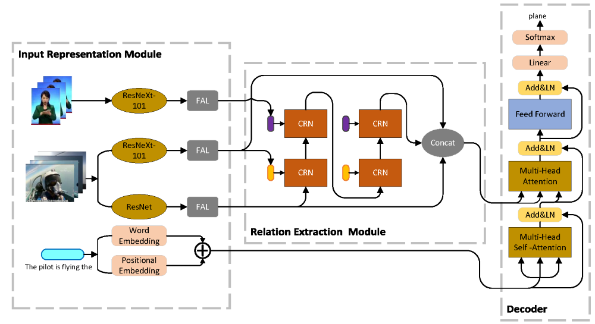

# Multimodal Relations Auxiliary Network (MRAN)  
In many news programs, sign language is provided for auditory-impaired people, which is relevant to video contents closely. 
Therefore, we propose a new video captioning task termed 
**S**ign **L**anguage **A**ssisted **V**ideo **C**aptioning (SLAVC) task.
We introduce **M**ultimodal **R**elations **A**uxiliary **N**etwork (MRAN) to handle SLAVC task:

|   MRAN Architecture  |
|:--------------------:|
|  |

MARN can model the relations between different modalities to help generate high-quality sentences. 

In addition, we propose China Focus On (CFO) dataset, which containing three modalities (_ie._ visual, sign language and audio), 
to explore SLAVC task. The preprocessed features and the json file (include URL, start time and end time, category, captions of each videos)
are available [here](https://mega.nz/folder/TypAGbjQ#8nNrZi2nvfRP_V3ws3yL5Q).

## Environment
~~~~bash
conda create -n MRAN python=3.6
conda activate MRAN
pip install torch torchvision torchaudio
pip install -r requirements.txt
~~~~

## Preprocess
Download [the preprocessed features and corpus](https://mega.nz/folder/TypAGbjQ#8nNrZi2nvfRP_V3ws3yL5Q) and place them to 
`data/CFO`.

If you want to use your own datasets, preprocess them as the following steps:
+ Extract appearance feature
~~~~bash
python preprocess/extract_feat.py --dataset CFO --feature_type appearance --image_height 224 --image_width 224 --gpu_id 0
~~~~
+ Extract motion feature  
Download ResNeXt-101 [pretrained model](https://mega.nz/file/PjomgLQD#479Ah9_51B8M8n8g7X2glfc1ETL5-6VZBghLNzURg0Q) 
(resnext-101-kinetics.pth) and place it to `data/preprocess/pretrained`.
~~~~bash
python preprocess/extract_feat.py --dataset CFO --feature_type motion --image_height 112 --image_width 112 --gpu_id 0
~~~~
+ Extract sign language feature
~~~~bash
python preprocess/extract_feat.py --dataset CFO --feature_type hand --image_height 112 --image_width 112 --gpu_id 0
~~~~
+ Build corpus
~~~~bash
python preprocess/build_vocab.py --dataset CFO -H 2
~~~~

## Training
Our pretrained model is available [here](https://mega.nz/file/z6QSwTQR#5qLB1tZdHYpFaIgJw_Ft1t0imxJnVNlQdHqNavRpbjE). 
Download and save it for evaluation. Or you can train a new model:
~~~~bash
python train.py --cfg configs/CFO.yml
~~~~

## Evaluation
~~~~bash
python evaluate.py --model_path {model_path} --save_path {save_path}
~~~~

## Acknowledgement
+ Some codes refer to [HCRN](https://github.com/thaolmk54/hcrn-videoqa)
